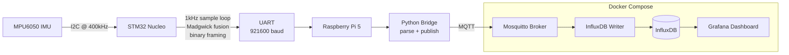

# Embedded IMU Telemetry System — Project Plan

**Project name (working title):** `imu-telemetry` *(rename when you've got something better)*
**Duration:** 9 weeks (with explicit buffer)
**Time budget:** ~6 hours/day project work, 5–6 days/week → ~270 hours total
**Author:** Maksim Koskin
**Goal:** Build a production-quality real-time embedded telemetry system end-to-end, using modern engineering practices, to deepen embedded skills and produce a portfolio-ready demonstration of competence for embedded engineering interviews.

---

## 1. Project Vision

A real-time IMU telemetry system that streams orientation data from an STM32 microcontroller — sampling an MPU6050 inertial sensor at 1 kHz, fusing accelerometer and gyroscope data into quaternions, and transmitting via a custom binary protocol — to a Raspberry Pi 5 gateway that publishes the data over MQTT into a time-series database, visualized live in a Grafana dashboard. The full system is built with a CMake-based command-line toolchain, version-controlled with conventional Git workflows, automatically tested and built with GitHub Actions CI/CD, deployed as containerized services with Docker Compose, and documented with auto-generated API docs.

**This is a miniature version of what real industrial telemetry systems look like.** The deliverable demonstrates: real-time embedded firmware, sensor integration, communication protocol design, testable code architecture, Linux services, containerization, time-series data, dashboards, and modern CI/CD — almost word-for-word matching the requirements section of typical Danish embedded job postings.

---

## 2. Architecture



**Data flow summary:** sensor → fused quaternion → framed packet → UART → parser → MQTT → time-series DB → dashboard.

**End-to-end target latency:** under 50 ms from sensor sample to dashboard render.

---

## 3. Repository Structure

```
imu-telemetry/
├── .github/
│   └── workflows/
│       ├── firmware.yml          # Build + unit test + static analysis
│       ├── gateway.yml           # Python lint + tests
│       └── docker.yml            # Container image build
├── firmware/                     # STM32 application
│   ├── CMakeLists.txt
│   ├── src/
│   ├── inc/
│   ├── drivers/                  # MPU6050, UART framing
│   ├── fusion/                   # Madgwick filter
│   ├── protocol/                 # Pure-C, host-testable
│   └── tests/                    # Unity unit tests
├── gateway/                      # Python service on Raspberry Pi
│   ├── pyproject.toml
│   ├── src/imu_gateway/
│   └── tests/
├── infra/                        # Docker Compose stack
│   ├── docker-compose.yml
│   ├── mosquitto/
│   ├── influxdb/
│   └── grafana/
│       └── dashboards/
├── docs/                         # Architecture, protocol spec, decisions
│   ├── architecture.md
│   ├── protocol.md
│   └── decisions/                # ADRs
├── scripts/                      # Helpers (flash, debug, measure)
├── .gitignore
├── .pre-commit-config.yaml
├── README.md
├── PROJECT_PLAN.md               # this file
├── LEARNING_LOG.md               # short daily notes
└── LICENSE
```

---

## 4. Tech Stack

| Layer | Technology |
|---|---|
| MCU | STM32 Nucleo (whichever you have — F4 / G4 / L4 etc.) |
| Sensor | MPU6050 (I2C, 6-axis IMU) |
| Firmware language | C (C11) for drivers/protocol, C++ (C++17) for fusion |
| Build system | CMake + arm-none-eabi-gcc (no IDE-locked builds) |
| Debug | OpenOCD + Cortex-Debug in VS Code |
| Unit testing | Unity + Ceedling (host-side) |
| Static analysis | cppcheck, clang-tidy, clang-format |
| API docs | Doxygen → GitHub Pages |
| Gateway language | Python 3.11+ |
| Gateway tooling | uv or pip + pyproject.toml, ruff, pytest, mypy |
| Messaging | MQTT (Eclipse Mosquitto) |
| Time-series DB | InfluxDB 2.x |
| Dashboard | Grafana |
| Containers | Docker + Docker Compose |
| CI/CD | GitHub Actions |
| Version control | Git, Conventional Commits, semantic versioning |
| Pre-commit | clang-format, ruff, trailing-whitespace |

---

## 5. Hardware Bill of Materials

| Component | Status |
|---|---|
| STM32 Nucleo board
| Raspberry Pi 5
| MPU6050 breakout
| Breadboard + jumper wires
| 4× pull-up resistors (4.7 kΩ for I2C if not on breakout) | check |
| USB cables for programming/UART |
| Logic analyzer (cheap Saleae clone)
| Multimeter | nice to have |

---

## 6. Working Rhythm

### Daily (8 hours total)

- **09:00–12:00 (3h)** — Hardest technical work; new concepts, debugging
- **12:00–13:00** — Lunch + walk outside (non-negotiable)
- **13:00–14:30 (1.5h)** — Lighter project work; documentation, refactoring, reading
- **14:30–14:45** — Break
- **14:45–16:15 (1.5h)** — Push to end-of-day milestone
- **16:15–18:15 (2h)** — Job applications + outreach (separate track, equally important)

### Weekly

- **Monday–Saturday** — Work
- **Sunday** — Off. Fully off. No coding. No applications. Recover.
- **End of week (Saturday afternoon)** — 30-min retrospective, update `LEARNING_LOG.md`, plan next week
- **Commit cadence** — Small, frequent commits with conventional commit messages. Aim for at least one PR per feature merged via your own review.

---

## 7. Definition of Done (project-wide)

A weekly milestone is "done" when:

1. Code is committed to a feature branch and merged into `main` via PR
2. CI passes (after Week 5, when CI exists)
3. New code has unit tests where reasonable
4. Code is documented (Doxygen comments for firmware APIs, docstrings for Python)
5. The README reflects the current capability of the system
6. You can demo it from a clean clone in under 10 minutes
7. You wrote a `LEARNING_LOG.md` entry for at least one thing you learned

---

## 8. Risk Register & Common Pitfalls

| Risk | Mitigation |
|---|---|
| **Toolchain rabbit hole (Week 1)** — Days lost getting CMake + OpenOCD + VS Code working | Timebox: max 2 days. If stuck, generate from STM32CubeMX with CMake output, get moving, refactor later. |
| **"I don't fully understand this" spiral** | Get it functional first. Understanding follows working code. Move on, return later if needed. |
| **Endless polish trap (Week 6+)** | Ship the imperfect version on schedule. Done > perfect. |
| **I2C debugging without a logic analyzer** | Buy one (€15). Without it, I2C debugging is guessing. |
| **Madgwick filter producing nonsense** | Validate the filter on synthetic data first. Test with known rotations. Don't trust the sensor until the math is verified. |
| **CI feedback loop breaks** | Test workflows locally with `act` if possible. Push small changes. |
| **Burnout** | The 8-hour cap and Sunday off are not optional. They are the plan. |
| **Project scope creep** | Stretch goals are explicitly Week 8 only. Resist adding features earlier. |
| **Losing application momentum** | The 2-hour application block is sacred. If you can't do 6+2, do 5+2 — never 8+0. |

---

## 9. Stretch Goals (Week 8 — pick ONE)

These are good-to-have, not must-have. Drop without guilt if Weeks 1–7 ran long.

- **3D Visualizer** — Three.js page subscribing to MQTT over WebSockets, rendering a live 3D model of the board's orientation. Highest visual impact for LinkedIn demo.
- **OTA Bootloader** — Custom UART bootloader supporting YModem firmware update. Highest "depth of embedded knowledge" signal for interviews.
- **Gesture Detection** — Simple template-matching classifier on accel windows ("flip", "shake", "tap"). Bridges nicely to your ML/thesis background.

---

## 10. Drop-If-Behind Priority List

If you fall behind, drop in this order (top first):

1. Stretch goal (Week 8)
2. Doxygen + GitHub Pages auto-deploy
3. Static analysis in CI (keep just build + unit tests)
4. Latency measurement instrumentation
5. **NEVER drop:** end-to-end pipeline, basic CI, README, unit tests for protocol layer, sensor fusion working

---

# Weekly Plan

## Week 1 — Foundations & Toolchain


### Goals

- Command-line build of an STM32 project from scratch (no IDE)
- VS Code debugging via OpenOCD + Cortex-Debug
- Monorepo initialized with proper Git hygiene
- Raspberry Pi 5 prepped and accessible
- LED blink + UART "hello world" working

### Daily breakdown

**Day 1 — Repo & Git foundations**
- [ ] `git init`, create GitHub repo (public, MIT license)
- [ ] Set up monorepo structure (see Section 3)
- [ ] Write initial `README.md` skeleton — vision, architecture diagram, status
- [ ] Configure Conventional Commits (https://www.conventionalcommits.org/)
- [ ] Install `pre-commit`, add hooks for trailing whitespace, file size, branch name
- [ ] Enable branch protection on `main` (require PR, require CI later)
- [ ] First commit: `chore: initial repository scaffolding`

**Day 2 — ARM toolchain on Debian**
- [ ] Install `gcc-arm-none-eabi`, `openocd`, `stlink-tools`, `cmake`, `ninja-build`
- [ ] Verify versions; document exact versions in `docs/dev-environment.md`
- [ ] Connect Nucleo, verify ST-Link detection (`st-info --probe`)
- [ ] Read your specific Nucleo board's user manual — pin map, default clock, ST-Link UART

**Day 3 — CMake-based STM32 project**
- [ ] Use a CMake template (recommended: https://github.com/STMicroelectronics/STM32CubeMX or https://github.com/ObKo/stm32-cmake)
- [ ] Get a minimal HAL-based blink building from CLI: `cmake -B build && cmake --build build`
- [ ] Flash via `openocd` or `st-flash`
- [ ] **Milestone:** LED blinks. Commit.

**Day 4 — VS Code + Debugging**
- [ ] Install Cortex-Debug, CMake Tools, C/C++ extensions
- [ ] Configure `launch.json` for OpenOCD debugging
- [ ] Set breakpoint, step through code, inspect registers
- [ ] Document setup in `docs/dev-environment.md`

**Day 5 — UART hello world**
- [ ] Configure USART on Nucleo (the one wired to ST-Link Virtual COM Port)
- [ ] `printf` redirected to UART (use `_write` retarget or `HAL_UART_Transmit`)
- [ ] Read it on host with `picocom` or `minicom` at 115200 baud
- [ ] **Milestone:** "Hello, world!" appears on host terminal

**Day 6 — Raspberry Pi 5 setup**
- [ ] Flash Raspberry Pi OS (64-bit, Lite is fine — no GUI needed)
- [ ] Headless setup with SSH enabled, configure static IP or hostname
- [ ] Install Docker + Docker Compose
- [ ] Wire Pi to Nucleo's UART (TX→RX, RX→TX, GND→GND)
- [ ] Read UART on Pi (`screen /dev/ttyAMA0 115200` or via `pyserial`)
- [ ] **Milestone:** Pi reads "Hello, world!" from STM32

**Day 7 — Buffer & polish**
- [ ] Catch up on anything behind
- [ ] Update README with current state
- [ ] Write a `LEARNING_LOG.md` entry summarizing the week
- [ ] Tag release: `v0.1.0-toolchain`

### Deliverables

- ✅ Monorepo on GitHub with proper structure
- ✅ STM32 builds and flashes from CLI
- ✅ Debugging works in VS Code
- ✅ STM32 → Pi UART communication verified
- ✅ `dev-environment.md` documenting setup so a stranger could reproduce it

### Resources

- *Mastering STM32* by Carmine Noviello — book; the canonical STM32 reference
- ST-Microelectronics RM00xx Reference Manual for your specific MCU
- STM32 CMake template repos (linked above)
- Conventional Commits spec
- Cortex-Debug docs

### Success criteria

You can `git clone`, run two commands, and have a blinking LED + UART output. The setup is reproducible.

---

## Week 2 — I2C Driver, Sample Loop & Protocol

### Goals

- Reading raw IMU data at 1 kHz
- Binary framing protocol designed and host-testable
- Unit testing infrastructure (Unity/Ceedling) running

### Daily breakdown

**Day 1 — I2C peripheral basics**
- [ ] Configure I2C peripheral (400 kHz fast mode)
- [ ] Write I2C scan utility — find MPU6050 at 0x68 or 0x69
- [ ] Read `WHO_AM_I` register, verify == 0x68
- [ ] **Use the logic analyzer** — observe I2C transactions, learn what they look like

**Day 2 — MPU6050 driver layer**
- [ ] Create `drivers/mpu6050.{h,c}` with clean API: `init()`, `read_accel_gyro()`
- [ ] Implement init sequence: wake from sleep, configure DLPF, set ranges, set sample rate divider
- [ ] Read accel + gyro at 100 Hz, print over UART
- [ ] Verify: still board → ~1g on Z-axis; rotate → values change

**Day 3 — Driver abstraction & testability**
- [ ] Refactor: separate `mpu6050_logic.c` (pure, testable) from `mpu6050_hal.c` (HAL calls)
- [ ] The pure layer takes function pointers / a transport struct for I2C read/write
- [ ] This pattern is **the** key embedded testability technique — internalize it

**Day 4 — 1 kHz sample loop**
- [ ] Configure a hardware timer for 1 kHz interrupt
- [ ] In ISR: trigger sample read (via DMA if possible, or flag for main loop)
- [ ] Implement a lock-free single-producer-single-consumer ring buffer
- [ ] Producer (ISR) writes samples; consumer (main loop) drains
- [ ] **Milestone:** 1000 samples/sec confirmed via UART output rate

**Day 5 — Binary protocol design**
- [ ] Design framing: `[SOF][LEN][TYPE][PAYLOAD][CRC16]`
- [ ] Document in `docs/protocol.md` with byte layouts and message types
- [ ] Define message types: `RAW_IMU`, `QUATERNION`, `STATUS`, `ERROR`
- [ ] Implement CRC-16-CCITT in pure C, header-only

**Day 6 — Protocol implementation & host parser**
- [ ] Implement encode/decode in `firmware/protocol/` with **zero HAL dependencies**
- [ ] Write a Python decoder in `gateway/` mirroring the protocol
- [ ] Verify round-trip: STM32 sends framed packet → Python parses correctly

**Day 7 — Unit tests**
- [ ] Set up Ceedling (or plain Unity + CMake) for host-side tests
- [ ] Tests for: CRC computation, frame encode/decode, malformed frame handling, ring buffer
- [ ] Run tests with `ceedling test:all` — they pass
- [ ] Tag: `v0.2.0-protocol`

### Deliverables

- ✅ MPU6050 driver with clean abstraction
- ✅ 1 kHz sampling proven
- ✅ Binary protocol spec in `docs/protocol.md`
- ✅ Host-runnable unit tests for protocol layer
- ✅ Python parser receiving framed packets correctly

### Key concepts to internalize

- **Hardware abstraction layers** — why testability matters more than elegance
- **ISR design** — keep them short, defer work via flags or queues
- **Ring buffers** — the embedded data structure
- **CRC vs checksum** — CRC catches more error patterns
- **Framing** — why you need start-of-frame + length, not just length

---

## Week 3 — Sensor Fusion

### Goals

- Stable, drift-free orientation output as quaternions
- Calibration routines
- Confidence in the math

### Daily breakdown

**Day 1 — Calibration**
- [ ] Gyro bias calibration: average 2000 samples at rest, subtract
- [ ] Accel scale verification: at rest, magnitude should be ≈ 9.81 m/s²
- [ ] Store bias values in flash (or hardcode after measuring) — your call
- [ ] Verify: stationary board → gyro reads ≈ 0 on all axes after calibration

**Day 2 — Quaternion fundamentals**
- [ ] Read up: quaternion representation (w, x, y, z), why we use them over Euler angles
- [ ] Implement quaternion math helpers in C++: multiply, normalize, to-Euler
- [ ] Unit-test the math against known cases (identity rotation, 90° rotations)

**Day 3 — Madgwick filter implementation**
- [ ] Reference: Sebastian Madgwick's original paper + reference C implementation
- [ ] Port into `firmware/fusion/madgwick.{hpp,cpp}` as a clean class
- [ ] Interface: `update(gx, gy, gz, ax, ay, az, dt) → quaternion`
- [ ] Initial beta value: 0.1 (tune later)

**Day 4 — Integration & streaming**
- [ ] Wire fusion into 1 kHz sample loop
- [ ] Send `QUATERNION` messages over UART at, say, 100 Hz (decimate)
- [ ] Send `RAW_IMU` at 100 Hz alongside, for debugging

**Day 5 — Validation**
- [ ] Hold board flat → quaternion ≈ (1, 0, 0, 0)
- [ ] Rotate 90° around X → expected quaternion values match
- [ ] Quick-rotate the board — does orientation track? Does it drift?
- [ ] If drift is bad → tune beta, re-check calibration

**Day 6 — Polish & Euler conversion**
- [ ] Add Euler angle output (roll/pitch/yaw) for human-readable debug
- [ ] Add a `STATUS` message with: sample rate, error count, beta value
- [ ] Improve filter stability under rapid rotation

**Day 7 — Buffer & document**
- [ ] Document filter choice in `docs/decisions/0001-madgwick-vs-kalman.md` (your first ADR)
- [ ] Update README with sensor fusion details
- [ ] Tag: `v0.3.0-fusion`

### Deliverables

- ✅ Stable quaternion output
- ✅ Calibration documented and reproducible
- ✅ ADR explaining filter choice
- ✅ Validated on physical rotations

### Resources

- Madgwick, S. *An efficient orientation filter for inertial and inertial/magnetic sensor arrays*
- "Quaternions and Rotations" — Stanford CS 348A notes
- Reference Madgwick C implementation (on his website)

---

## Week 4 — Linux Pipeline & Dashboard

### Goals

- Production-quality Python service
- Full Docker Compose stack running
- Live dashboard reacting to motion

### Daily breakdown

**Day 1 — Python project setup**
- [ ] `gateway/` with `pyproject.toml` (use `uv` or `pip-tools`)
- [ ] Set up: ruff, pytest, mypy, type hints from day 1
- [ ] Project layout: `src/imu_gateway/`, `tests/`
- [ ] Logging configured (structured logs, JSON-friendly)

**Day 2 — Serial reader**
- [ ] `serial_reader.py` — opens UART, framing-aware, recovers from corruption
- [ ] Async-friendly (use `asyncio` or threads — your call)
- [ ] Robust against: partial frames, bad CRC, USB disconnects
- [ ] Tests with pre-recorded byte streams

**Day 3 — MQTT publisher**
- [ ] Use `paho-mqtt` (or `aiomqtt`)
- [ ] Topics: `imu/raw`, `imu/quaternion`, `imu/status`
- [ ] JSON payloads with timestamps
- [ ] Reconnect logic with backoff

**Day 4 — Docker Compose stack**
- [ ] `infra/docker-compose.yml` with: Mosquitto, InfluxDB 2.x, Grafana
- [ ] Persistent volumes for InfluxDB and Grafana
- [ ] Initial config files for each service
- [ ] `docker compose up` brings everything online; access Grafana at `:3000`

**Day 5 — MQTT → InfluxDB**
- [ ] Either: write a custom Python subscriber that writes to InfluxDB, or use Telegraf
- [ ] Recommend the Python approach for learning value
- [ ] Verify: data appearing in InfluxDB via the UI's Data Explorer

**Day 6 — Grafana dashboard**
- [ ] Connect Grafana to InfluxDB
- [ ] Build panels: quaternion components (line chart), Euler angles (line chart), packet rate (gauge), error count (stat)
- [ ] Save dashboard JSON to `infra/grafana/dashboards/` so it's version-controlled

**Day 7 — End-to-end & polish**
- [ ] Boot the whole pipeline cold, observe live data
- [ ] Rotate board → dashboard updates
- [ ] Capture screenshots / a short screen recording for the README
- [ ] Tag: `v0.4.0-pipeline`

### Deliverables

- ✅ Production-quality Python gateway service
- ✅ Docker Compose stack with persistent data
- ✅ Live, version-controlled Grafana dashboard
- ✅ Full sensor → dashboard pipeline working

---

## Week 5 — CI/CD & Quality Gates

### Goals

- Every push runs build + tests + analysis
- PRs blocked on green CI
- Auto-published API docs

### Daily breakdown

**Day 1 — Firmware build in CI**
- [ ] `.github/workflows/firmware.yml` — installs ARM toolchain, builds firmware
- [ ] Artifact upload: `.elf`, `.bin`, `.map`
- [ ] Matrix build if you support multiple Nucleo variants

**Day 2 — Firmware unit tests in CI**
- [ ] Run Unity tests on the host (Ubuntu runner)
- [ ] Coverage report (gcov + lcov)
- [ ] Fail CI on test failure

**Day 3 — Static analysis**
- [ ] `cppcheck` job — fail on errors, warn on style
- [ ] `clang-tidy` with a sensible `.clang-tidy` config
- [ ] `clang-format --dry-run --Werror` to enforce formatting

**Day 4 — Python CI**
- [ ] `gateway.yml` — ruff, mypy, pytest with coverage
- [ ] Run on Python 3.11 and 3.12 matrix

**Day 5 — Docker build CI**
- [ ] Build all containers in `infra/`
- [ ] Optionally: push to GitHub Container Registry on tag

**Day 6 — Doxygen + GitHub Pages**
- [ ] Doxygen config for firmware
- [ ] Workflow that builds docs and deploys to `gh-pages` branch
- [ ] Add docs link to README

**Day 7 — Branch protection & polish**
- [ ] Enable: require PR, require CI to pass, require up-to-date branch
- [ ] PR template (`.github/pull_request_template.md`)
- [ ] Issue templates (bug report, feature request)
- [ ] CI status badges in README
- [ ] Tag: `v0.5.0-ci`

### Deliverables

- ✅ Green CI on every push
- ✅ Auto-published API docs
- ✅ Quality gates enforcing formatting, linting, tests
- ✅ Professional-looking PR/issue workflow

---

## Week 6 — Performance, Polish & The README

### Goals

- Measured end-to-end latency
- A README a stranger can read in 3 minutes and understand the project
- Demo material (GIF/video) ready

### Daily breakdown

**Day 1 — Latency instrumentation**
- [ ] GPIO toggle on STM32 at sample time
- [ ] Pi-side timestamp at MQTT publish
- [ ] InfluxDB-side timestamp on write
- [ ] Compute end-to-end latency, log it

**Day 2 — Performance benchmarks**
- [ ] Measure: sample-to-publish latency, sustained packet rate, CPU usage on Pi
- [ ] Document numbers in `docs/performance.md`
- [ ] Add benchmark numbers to README

**Day 3 — Architecture diagrams**
- [ ] Mermaid diagrams in `docs/architecture.md`
- [ ] Sequence diagram for protocol exchange
- [ ] Block diagram for hardware setup

**Day 4 — README master draft**
- [ ] Hero image / GIF at top
- [ ] What it is (one paragraph)
- [ ] Features (bullet list)
- [ ] Architecture (diagram + paragraph)
- [ ] Hardware setup (with photo)
- [ ] Quick start (clone → run in 10 minutes)
- [ ] Tech stack (table)
- [ ] Performance numbers (table)
- [ ] Design decisions (link to ADRs)
- [ ] License

**Day 5 — Demo material**
- [ ] Record screen capture of dashboard reacting to physical rotation
- [ ] Convert to GIF (peek, ffmpeg)
- [ ] Embed in README

**Day 6 — Hardware photos**
- [ ] Clean photo of the wired-up setup
- [ ] Annotated diagram showing connections
- [ ] Embed in README and `docs/`

**Day 7 — Lessons learned**
- [ ] Write `docs/lessons-learned.md` — what surprised you, what you'd do differently
- [ ] This is gold for interview answers
- [ ] Tag: `v0.6.0-polished`

### Deliverables

- ✅ Production-quality README with demo GIF
- ✅ Measured performance numbers
- ✅ Clean architecture documentation
- ✅ Lessons learned doc (invaluable for interviews)

---

## Week 7 — Buffer Week

> This week exists because reality always disagrees with plans. Use it.

### Possible uses (in priority order)

- [ ] Catch up on anything that slipped in Weeks 1–6
- [ ] Fix bugs uncovered while writing the README
- [ ] Improve test coverage where it's thin
- [ ] Add more docstrings / Doxygen comments
- [ ] Refactor the one part of the code you know is ugly
- [ ] If genuinely caught up: start Week 8 stretch goal early

### If everything is on track

Use this week to internalize. Re-read your own code. Write interview-prep notes (see Section 11). Practice explaining the project out loud — to a rubber duck, to a friend, to me.

---

## Week 8 — Stretch Goal (pick ONE)

### Option A: 3D Visualizer (highest visual impact)

- [ ] Bridge MQTT → WebSockets (use a small Node.js or Python WebSocket server)
- [ ] Three.js page rendering a board model
- [ ] Subscribe to quaternion stream, apply rotation to model
- [ ] Host on GitHub Pages or include in docker-compose
- **Demo value:** ★★★★★ — looks amazing in a LinkedIn post

### Option B: OTA Bootloader (highest depth signal)

- [ ] Custom UART bootloader in `firmware/bootloader/`
- [ ] Implements YModem protocol for receiving firmware
- [ ] Writes to alternate flash bank, sets boot flag, jumps
- [ ] Host-side Python script to send new firmware
- **Demo value:** ★★★★ — interview gold for embedded depth

### Option C: Gesture Detection (bridges to your ML background)

- [ ] Collect labeled accel windows for 3–4 gestures
- [ ] Simple template matching or 1D-CNN classifier
- [ ] Run inference on STM32 (CMSIS-NN if needed)
- [ ] Publish gesture events over MQTT
- **Demo value:** ★★★ — ties to thesis nicely

### Tag at end of week

`v0.8.0-stretch` (or `v0.8.0-3d`, `v0.8.0-bootloader`, `v0.8.0-gestures`)

---

## Week 9 — Visibility & Job Search Integration

> The project doesn't exist if nobody knows about it.

### Daily breakdown

**Day 1–2 — Final polish**
- [ ] Read through README from a stranger's perspective
- [ ] Fix every typo, broken link, unclear sentence
- [ ] Pin the repo on your GitHub profile
- [ ] Verify the "10-minute clone-to-run" still works on a fresh machine

**Day 3 — Update CV**
- [ ] New project entry highlighting the stack and outcomes
- [ ] Specific numbers (1 kHz sampling, X ms latency, Y% test coverage)
- [ ] GitHub link prominent at top of CV

**Day 4 — LinkedIn post**
- [ ] Demo GIF + 200–300 word writeup
- [ ] Tag relevant tech (#embeddedsystems #stm32 #cicd)
- [ ] Post in the morning (Tue/Wed best for Danish tech audience)
- [ ] Engage with comments thoughtfully

**Day 5 — Interview prep**
- [ ] Write `INTERVIEW_NOTES.md` with anticipated questions and your answers
- [ ] See Section 11 for question list
- [ ] Practice the project walk-through out loud (5-min, 15-min versions)

**Day 6 — Outreach push**
- [ ] Message every recruiter and engineer you've contacted previously with the link
- [ ] "I built this — would love your feedback or to chat about it"
- [ ] Submit applications you've been holding back on

**Day 7 — Reflection**
- [ ] Final `LEARNING_LOG.md` entry summarizing the 9 weeks
- [ ] Decide what's next: another project? A specific specialization? Apply intensively?
- [ ] Take Sunday completely off. Celebrate.

### Deliverables

- ✅ Pinned, polished GitHub repo
- ✅ Updated CV referencing the project
- ✅ LinkedIn post live with demo
- ✅ Interview prep notes complete
- ✅ Active conversations with recruiters / engineers about the project

---

## 11. Interview Talking Points

Build these answers as you go. By Week 9 you should be able to answer all of these in 1–3 sentences each.

### Architecture & decisions
- Why a custom binary protocol instead of JSON over UART?
- Why MQTT instead of HTTP?
- Why InfluxDB instead of PostgreSQL?
- Why CMake instead of STM32CubeIDE?
- Why Madgwick instead of Kalman or complementary filter?
- Why I2C instead of SPI for the IMU?

### Embedded specifics
- How did you ensure the 1 kHz sample loop doesn't miss deadlines?
- What happens if the UART buffer overflows? How did you handle backpressure?
- How did you make your firmware testable on a host machine?
- What's in your ISR vs. main loop and why?
- How did you handle clock sources and timing accuracy?

### Quality & process
- How does your CI pipeline catch problems before they reach `main`?
- How do you measure code coverage for embedded code?
- What's your branching strategy?
- How did you handle a hard bug? (have a real story ready — write it down as it happens)

### Performance
- What's your end-to-end latency? How did you measure it?
- Where's the bottleneck?
- What would you do to reduce it further?

### Self-reflection (the one most candidates fumble)
- What would you do differently if starting over?
- What part of this project pushed you the most?
- What's the biggest thing you learned?

---

## 12. Final Notes

### What this project will give you

- A repository that demonstrates competence across the full embedded stack
- Genuine fluency with modern tooling (CMake, Docker, CI/CD, MQTT, Grafana)
- 30+ specific stories and design decisions to draw on in interviews
- Renewed confidence backed by concrete output, not just credentials

### What this project won't give you

- A guarantee of a job offer (no project does)
- Permission to delay applying — you're already qualified
- Mastery of every embedded subdomain — nobody has that

### The one rule that matters

**Ship something every week.** Even if it's small. Even if it's ugly. The repo gets a tag every week. Momentum compounds; perfection paralyzes.

---

## 13. Quick-Reference Tag Schedule

| Week | Tag | Marker |
|---|---|---|
| 1 | `v0.1.0-toolchain` | LED blinks, UART works, repo set up |
| 2 | `v0.2.0-protocol` | IMU at 1 kHz, framed packets, unit tests |
| 3 | `v0.3.0-fusion` | Quaternions streaming, validated |
| 4 | `v0.4.0-pipeline` | End-to-end dashboard working |
| 5 | `v0.5.0-ci` | Full CI/CD pipeline green |
| 6 | `v0.6.0-polished` | README + performance numbers |
| 7 | `v0.7.0-buffer` | (optional, if anything new lands) |
| 8 | `v0.8.0-stretch` | Stretch goal complete |
| 9 | `v1.0.0` | Project complete and public |

---

*This plan is a guide, not a contract. Adjust as reality demands. The goal is a finished project, a working brain, and an active job search by mid-July — not perfect adherence to a calendar.*
